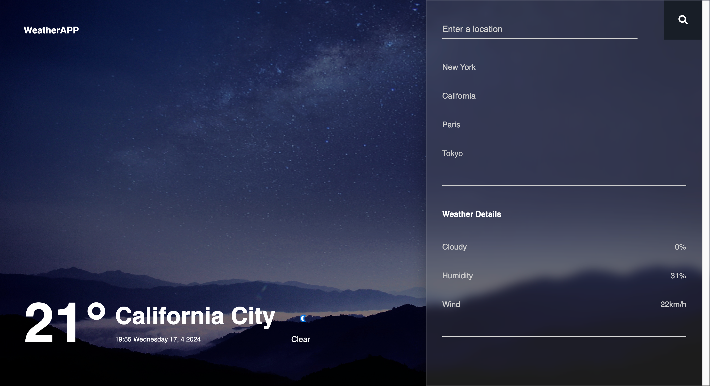

# WeatherApp



## Description

This is a simple weather web application that allows users to check the current weather conditions of various cities. Users can either select from a list of predefined cities or search for a specific city using the search bar. The application fetches weather data from the [WeatherAPI](http://api.weatherapi.com/) and displays it in a user-friendly interface.

## Features

- Display current temperature, weather condition, date, and time
- Show weather icons corresponding to the current weather condition
- Display additional weather details such as cloudiness, humidity, and wind speed
- Ability to select predefined cities or search for a specific city
- Simple animations for a smoother user experience

## Technologies Used

- HTML5
- CSS3 (with Flexbox and Grid for layout)
- JavaScript (ES6)
- [WeatherAPI](http://api.weatherapi.com/) for fetching weather data

## Installation

1. Clone the repository:

   ```bash
   git clone https://github.com/x86skwizer/WeatherApp.git
   ```

2. Navigate to the project directory:

   ```bash
   cd WeatherApp
   ```

3. Open the `index.html` file in your web browser.

## Configuration Steps

1. **Sign Up for WeatherAPI Account**:
   - If you haven't already, sign up for a free account on the [WeatherAPI website](https://www.weatherapi.com/signup.aspx).
   - Once registered, you will receive an API key that you'll use to authenticate your requests.

2. **API Key Integration**:
   - Open the `main.js` file in your weather web application project.
   - Find the line where the WeatherAPI URL is constructed for fetching weather data:

     ```javascript
     fetch(`http://api.weatherapi.com/v1/current.json?key=YOUR_API_KEY&q=${cityInput}`)
     ```

   - Replace `YOUR_API_KEY` with your actual WeatherAPI key.

3. **Test Your Configuration**:
   - After integrating your API key, run your weather web application.
   - Search for a city or select a predefined city to view its weather details.
   - Ensure that the weather details are being fetched and displayed correctly.

## Usage

- Click on one of the predefined cities to view the weather details for that city.
- Alternatively, type the name of a city into the search bar and press Enter or click the "Search" button to fetch and display the weather details for that city.
- The weather details including temperature, condition, date, time, cloudiness, humidity, and wind speed will be displayed on the screen along with an appropriate weather icon.

## Contribution

Contributions are welcome! Here are a few ways you can contribute:

- **Bug Fixes**: If you find any bugs, feel free to open an issue or submit a pull request.
- **Feature Requests**: If you have any ideas for new features or improvements, please let us know by opening an issue.
- **Code Contributions**: We welcome code contributions through pull requests. Before submitting a pull request, please make sure your code follows the project's coding conventions and that tests pass locally.

## Credits

- Weather data provided by [WeatherAPI](http://api.weatherapi.com/)
